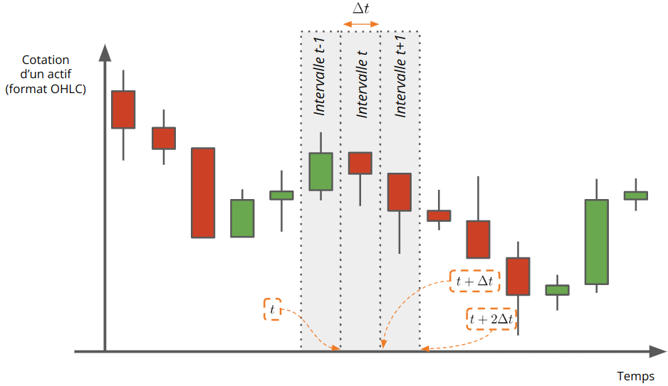
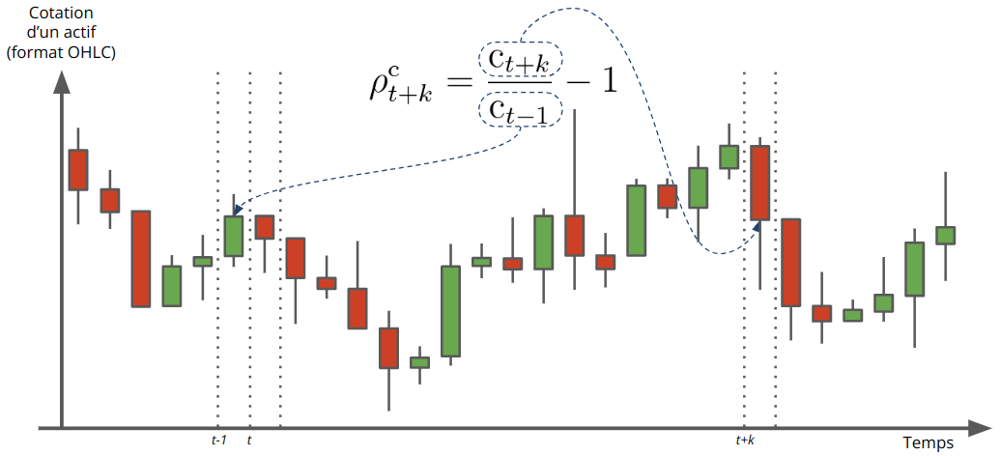
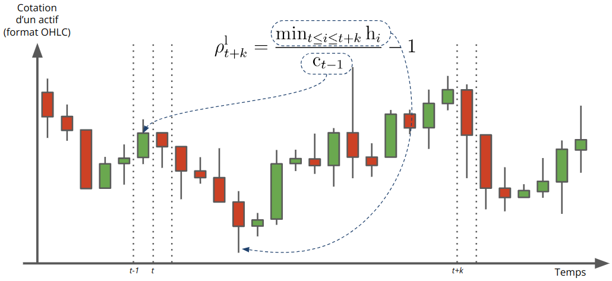

# Table des matières

1.  [Introduction](#introduction)
2.  [Historical OHLCV Data](#données-historiques-ohlcv)
3.  [Mathematical Notations](#org0f96284)
    1.  [Temporal Notions](#org5eb0df9)
    2.  [Candlestick](#orga7fcb8f)
    3.  [Returns](#org59ea95f)
4.  [Extension de la notion de rendements](#extension-de-la-notion-de-rendements)
    1.  [Definitions](#définitions)
    2.  [Closing returns](#org4674f4c)
    3.  [Maximum and minimum return](#org2116f4e)
5.  [Technical environment](#org64d206a)
6.  [References](#org0458811)

# Introduction

In the field of financial market analysis, technical analysis refers to a set of tools aimed at
predicting the future returns of financial assets. These analyses rely on studying the historical
market data available, primarily the price and volume of the considered assets. 

The majority of the presented methodologies rely on the construction of specific indicators deemed
relevant by their authors. However, the evaluation of these indicators is typically based on
empirical backtesting on arbitrarily chosen and relatively short periods, especially in the case of
intraday analysis. Like the authors of the article <farias_nazario_literature_2017>, we agree
that assessing the performance of technical analysis requires mathematical consolidation. To address
this, we propose to develop an innovative strategy for evaluating technical indicators based on the
analysis of the conditional distribution of returns relative to observed indicators.  

This document aims to present our approach to the development and evaluation of technical indicators
for the technical analysis of crypto-assets. Additionally, we provide the Python source code used to
obtain each of the results, giving a first glimpse of the functionalities of the MOSAIC library. 

# Historical OHLCV Data

The evolution of an asset's price over time is commonly presented in the form of data known as OHLCV (Open, High, Low, Close, Volume). This format allows for the representation of time series data in a specific way. The OHLC format represents the evolution of a measurement over successive regular time intervals, characterized by a sampling period denoted as $\Delta t$ (e.g., one minute, five minutes, one hour, one day, etc).

Typically, OHLCV data contains the following variables:

-   `timestamp`: a timestamp indicating the start $t$ of the measurement interval (e.g., expressed in milliseconds or in ISO format). The end of the interval is equal to $t + \Delta t$.
-   `open`: the asset's value at the beginning of the interval.
-   `high`: the maximum value of the asset reached during the interval.
-   `low`: the minimum value of the asset reached during the interval.
-   `close`: the asset's value at the end of the interval.
-   `volume`: the cumulative amount of asset sales and purchases during the interval.

OHLC data is commonly visualized using candlestick charts. Based on the opening and closing values,
candlesticks are classified as bullish or bearish, as shown in Figure [13](#orga674955). 

In a candlestick chart, the OHLC data is accompanied by the concepts of:

-   Body: representing the distance between the opening and closing prices of the asset over a time interval.
-   Upper shadow: representing the distance between the top of the body and the highest price over a time interval.
-   Lower shadow: representing the distance between the bottom of the body and the lowest price over a time interval.

The following table provides an overview of the initial BTC price data relative to USDC in the year
2021, with a sampling period of $\Delta t = 5$ minutes. 

    # This code retrieves historic OHLCV data for the "BTC/USDC" symbol from the "binance"
    # exchange and stores it in a DataFrame called `ohlcv_format_ex_df`. 
    
    # Imports the necessary libraries, including `pandas`, `plotly`, and the MOSAIC library.
    import pandas as pd
    import plotly.io as pio
    import mosaic
    import mosaic.utils as mut
    import mosaic.indicator as mid
    import mosaic.trading as mtr
    
    # Creates an instance of the `mtr.ExchangeCCXT` class, representing the "binance"
    # exchange, and establishes a connection to it.
    exchange = mtr.ExchangeCCXT(name="binance")
    exchange.connect()
    
    # Initializes a `mut.DSOHLCV` (Data Source OHLCV object),
    # specifying the symbol ("BTC/USDC"), timeframe ("5m"), and a date range for the data.
    ds_ex = mut.DSOHLCV(
        symbol="BTC/USDC",
        timeframe="5m",
        dt_start='2021-01-01 01:00:00',
        dt_end='2021-01-02 01:00:00',
    )
    
    # Uses the `exchange.get_historic_ohlcv()` method to retrieve the
    # historic OHLCV (Open, High, Low, Close, Volume) data for the
    # specified symbol and timeframe from the "binance" exchange.
    # The data is stored in a DataFrame called `ohlcv_format_ex_df`.
    ohlcv_format_ex_df = \
        exchange.get_historic_ohlcv(
            date_start=ds_ex.dt_s,
            date_end=ds_ex.dt_e,
            symbol=ds_ex.symbol,
            timeframe=ds_ex.timeframe,
            index="datetime",
            data_dir=".",
            force_reload=False,
            progress_mode=True,
        ).drop("timestamp", axis=1)
    
    # Take a sample of 5 time intervals for the examples in the document
    data_ohlcv_ex_5 = ohlcv_format_ex_df.head()

<table id="T_b974f">
  <thead>
    <tr>
      <th class="blank level0" >&nbsp;</th>
      <th id="T_b974f_level0_col0" class="col_heading level0 col0" >open</th>
      <th id="T_b974f_level0_col1" class="col_heading level0 col1" >high</th>
      <th id="T_b974f_level0_col2" class="col_heading level0 col2" >low</th>
      <th id="T_b974f_level0_col3" class="col_heading level0 col3" >close</th>
      <th id="T_b974f_level0_col4" class="col_heading level0 col4" >volume</th>
    </tr>
    <tr>
      <th class="index_name level0" >datetime</th>
      <th class="blank col0" >&nbsp;</th>
      <th class="blank col1" >&nbsp;</th>
      <th class="blank col2" >&nbsp;</th>
      <th class="blank col3" >&nbsp;</th>
      <th class="blank col4" >&nbsp;</th>
    </tr>
  </thead>
  <tbody>
    <tr>
      <th id="T_b974f_level0_row0" class="row_heading level0 row0" >2021-01-01 01:00:00+01:00</th>
      <td id="T_b974f_row0_col0" class="data row0 col0" >28 964.54</td>
      <td id="T_b974f_row0_col1" class="data row0 col1" >29 064.55</td>
      <td id="T_b974f_row0_col2" class="data row0 col2" >28 958.66</td>
      <td id="T_b974f_row0_col3" class="data row0 col3" >29 018.17</td>
      <td id="T_b974f_row0_col4" class="data row0 col4" >8.77</td>
    </tr>
    <tr>
      <th id="T_b974f_level0_row1" class="row_heading level0 row1" >2021-01-01 01:05:00+01:00</th>
      <td id="T_b974f_row1_col0" class="data row1 col0" >28 993.74</td>
      <td id="T_b974f_row1_col1" class="data row1 col1" >28 996.04</td>
      <td id="T_b974f_row1_col2" class="data row1 col2" >28 890.99</td>
      <td id="T_b974f_row1_col3" class="data row1 col3" >28 914.30</td>
      <td id="T_b974f_row1_col4" class="data row1 col4" >11.15</td>
    </tr>
    <tr>
      <th id="T_b974f_level0_row2" class="row_heading level0 row2" >2021-01-01 01:10:00+01:00</th>
      <td id="T_b974f_row2_col0" class="data row2 col0" >28 902.53</td>
      <td id="T_b974f_row2_col1" class="data row2 col1" >28 908.49</td>
      <td id="T_b974f_row2_col2" class="data row2 col2" >28 741.86</td>
      <td id="T_b974f_row2_col3" class="data row2 col3" >28 790.00</td>
      <td id="T_b974f_row2_col4" class="data row2 col4" >4.58</td>
    </tr>
    <tr>
      <th id="T_b974f_level0_row3" class="row_heading level0 row3" >2021-01-01 01:15:00+01:00</th>
      <td id="T_b974f_row3_col0" class="data row3 col0" >28 798.99</td>
      <td id="T_b974f_row3_col1" class="data row3 col1" >28 891.63</td>
      <td id="T_b974f_row3_col2" class="data row3 col2" >28 798.29</td>
      <td id="T_b974f_row3_col3" class="data row3 col3" >28 884.38</td>
      <td id="T_b974f_row3_col4" class="data row3 col4" >4.31</td>
    </tr>
    <tr>
      <th id="T_b974f_level0_row4" class="row_heading level0 row4" >2021-01-01 01:20:00+01:00</th>
      <td id="T_b974f_row4_col0" class="data row4 col0" >28 845.04</td>
      <td id="T_b974f_row4_col1" class="data row4 col1" >28 886.67</td>
      <td id="T_b974f_row4_col2" class="data row4 col2" >28 789.15</td>
      <td id="T_b974f_row4_col3" class="data row4 col3" >28 885.73</td>
      <td id="T_b974f_row4_col4" class="data row4 col4" >13.21</td>
    </tr>
  </tbody>
</table>

For example, the first row of the table indicates that on 01/01/2021:

-   At 01:00:00, the price of one BTC was 28964.54 USDC.
-   Between 01:00:00 and 01:05:00, the price of one BTC was between 29018.17 USDC (closing of the current interval) and 28993.74 USDC (opening of the next interval).
-   Between 01:00:00 and 01:05:00, the price of one BTC reached a minimum of 28958.66 USDC and a maximum of 29064.55 USDC.

Since the BTC/USDC market is open 24/7, we should expect $\text{close}(t-1)$ to be equal to
$\text{open}(t)$ for all $t$. However, due to the delay in data collection, it is common to observe
slight differences between the opening price of the current time interval and the closing price of
the previous interval. 

# Mathematical Notations

## Temporal Notions

We previously introduced the sampling period of the data, $\Delta t$. We also denote $t_{0}$ as the first sampling date. In the previous data example, we recall that $\Delta t = 5$ minutes and $t_{0} =$ 2021-01-01 01:00:00.

Each time interval is identified by the moment at which it starts. Thus, interval $t$ refers to the time interval that begins at time $t$ and ends at time $t + \Delta t$ (see Figure [30](#orgc800fc9)).

To orient ourselves relative to a given interval $t$ in the case of a sampling period $\Delta t$, we denote the interval $t + k$, where $k$ is an integer, as the interval that starts at time $t + k \Delta t$ and ends at time $t + (k + 1) \Delta t$.

Using the previous example, we have:

-   Interval $t_{0}$ between 2021-01-01 01:00:00 and 2021-01-01 01:05:00.
-   Interval $t_{0} + 4$ between 2021-01-01 01:20:00 and 2021-01-01 01:25:00.

The OHLCV data is denoted as follows:

-   $\text{o}_{t}$: the asset's price at the opening of interval $t$.
-   $\text{c}_{t}$: the asset's price at the closing of interval $t$, i.e., the price at time $t + \Delta t$.
-   $\text{h}_{t}$: the maximum price of the asset during interval $t$.
-   $\text{l}_{t}$: the minimum price of the asset during interval $t$.
-   $\text{v}_{t}$: the volume traded for the asset during interval $t$.

## Candlestick

In addition to the previous notations, we can introduce various measures associated with different parts of the candlestick chart.

Considering the candlestick representing the OHLC data for interval $t$, we have:

-   The body $\text{b}_{t} = \text{c}_{t} - \text{o}_{t}$.
-   The lower shadow $\text{s}_{t}^{\ell} = \min\{\text{c}_{t}, \text{o}_{t}\} - \text{l}_{t}$.
-   The upper shadow $\text{s}_{t}^{u} = \text{h}_{t} - \max\{\text{c}_{t}, \text{o}_{t}\}$.

## Returns

Finally, we denote $r_{t}$ as the relative change in an asset's price between two consecutive
intervals, also known as the return for interval $t$. For all $t$, we have:

\begin{equation}
\label{org9b01c67}
r_{t} = \frac{\text{c}_{t}}{\text{c}_{t - 1}} - 1.
\end{equation}

The quantity $r_{t}$ is positive if the asset gains value in interval $t$ and negative otherwise. The return is the primary indicator used in all financial analyses conducted on a given asset.

# Extension de la notion de rendements

## Definitions

Calculating returns is a fundamental step in analyzing the behavior of an asset over time. The
definition of returns provided in the previous section is limited to the return on the closing price
between two consecutive time intervals. 

We will now extend the definition of returns:

-   On one hand, to include returns on the maximum and minimum prices.
-   On the other hand, to encompass returns between two given time intervals, $t$ and $t + k$.

In the following paragraphs, we will illustrate the different returns using the excerpt of BTC/USDC
price data. 

    fig = mut.plotly_ohlcv(data_ohlcv_ex_5,
                           layout=dict(title="Example of OHLC data on BTC/USDC pair",
                                       yaxis_title="USDC",
                                       xaxis_title="Time"))
    
    fig

                        
                        

                    

## Closing returns

Let's start by defining the closing return between two intervals $t$ and $t+k$ as follows (cf. Figure
[51](#org4457db2)) :

\begin{equation}
\rho^{\text{c}}_{t + k} = 
\begin{cases}
\frac{\text{c}_{t + k}}{\text{c}_{t-1}} - 1 & \quad k \ge 0 \\
\frac{\text{c}_{t }}{\text{c}_{t + k - 1}} - 1 & \quad k < 0.
\end{cases}
\end{equation}

Note that $k$ is an integer that represents the number of future or past intervals to consider for the calculation of the return.

**Examples**

Closing returns calculated on the data from the previous example and different horizons:

    # The code concatenates the returns calculated at different horizons (-3, -2, -1, 0, 1, 2, 3)
    # into a single DataFrame. 
    # Each return at a specific horizon is calculated using the MOSAIC `mid.Returns()` class with
    # the specified horizon value. The `.compute` method computes the returns from the `data_ohlcv_ex_5` data. 
    ref_df = pd.concat([
        mid.Returns(horizon=h).compute(data_ohlcv_ex_5)\
        for h in [-3,-2,-1,0,1,2,3]], axis=1)

<table id="T_ca1d2">
  <thead>
    <tr>
      <th class="blank level0" >&nbsp;</th>
      <th id="T_ca1d2_level0_col0" class="col_heading level0 col0" >ret_close_-3</th>
      <th id="T_ca1d2_level0_col1" class="col_heading level0 col1" >ret_close_-2</th>
      <th id="T_ca1d2_level0_col2" class="col_heading level0 col2" >ret_close_-1</th>
      <th id="T_ca1d2_level0_col3" class="col_heading level0 col3" >ret_close_0</th>
      <th id="T_ca1d2_level0_col4" class="col_heading level0 col4" >ret_close_1</th>
      <th id="T_ca1d2_level0_col5" class="col_heading level0 col5" >ret_close_2</th>
      <th id="T_ca1d2_level0_col6" class="col_heading level0 col6" >ret_close_3</th>
    </tr>
    <tr>
      <th class="index_name level0" >datetime</th>
      <th class="blank col0" >&nbsp;</th>
      <th class="blank col1" >&nbsp;</th>
      <th class="blank col2" >&nbsp;</th>
      <th class="blank col3" >&nbsp;</th>
      <th class="blank col4" >&nbsp;</th>
      <th class="blank col5" >&nbsp;</th>
      <th class="blank col6" >&nbsp;</th>
    </tr>
  </thead>
  <tbody>
    <tr>
      <th id="T_ca1d2_level0_row0" class="row_heading level0 row0" >2021-01-01 01:00:00+01:00</th>
      <td id="T_ca1d2_row0_col0" class="data row0 col0" ></td>
      <td id="T_ca1d2_row0_col1" class="data row0 col1" ></td>
      <td id="T_ca1d2_row0_col2" class="data row0 col2" ></td>
      <td id="T_ca1d2_row0_col3" class="data row0 col3" ></td>
      <td id="T_ca1d2_row0_col4" class="data row0 col4" ></td>
      <td id="T_ca1d2_row0_col5" class="data row0 col5" ></td>
      <td id="T_ca1d2_row0_col6" class="data row0 col6" ></td>
    </tr>
    <tr>
      <th id="T_ca1d2_level0_row1" class="row_heading level0 row1" >2021-01-01 01:05:00+01:00</th>
      <td id="T_ca1d2_row1_col0" class="data row1 col0" ></td>
      <td id="T_ca1d2_row1_col1" class="data row1 col1" ></td>
      <td id="T_ca1d2_row1_col2" class="data row1 col2" ></td>
      <td id="T_ca1d2_row1_col3" class="data row1 col3" >-0.358%</td>
      <td id="T_ca1d2_row1_col4" class="data row1 col4" >-0.786%</td>
      <td id="T_ca1d2_row1_col5" class="data row1 col5" >-0.461%</td>
      <td id="T_ca1d2_row1_col6" class="data row1 col6" >-0.456%</td>
    </tr>
    <tr>
      <th id="T_ca1d2_level0_row2" class="row_heading level0 row2" >2021-01-01 01:10:00+01:00</th>
      <td id="T_ca1d2_row2_col0" class="data row2 col0" ></td>
      <td id="T_ca1d2_row2_col1" class="data row2 col1" ></td>
      <td id="T_ca1d2_row2_col2" class="data row2 col2" >-0.786%</td>
      <td id="T_ca1d2_row2_col3" class="data row2 col3" >-0.430%</td>
      <td id="T_ca1d2_row2_col4" class="data row2 col4" >-0.103%</td>
      <td id="T_ca1d2_row2_col5" class="data row2 col5" >-0.099%</td>
      <td id="T_ca1d2_row2_col6" class="data row2 col6" ></td>
    </tr>
    <tr>
      <th id="T_ca1d2_level0_row3" class="row_heading level0 row3" >2021-01-01 01:15:00+01:00</th>
      <td id="T_ca1d2_row3_col0" class="data row3 col0" ></td>
      <td id="T_ca1d2_row3_col1" class="data row3 col1" >-0.461%</td>
      <td id="T_ca1d2_row3_col2" class="data row3 col2" >-0.103%</td>
      <td id="T_ca1d2_row3_col3" class="data row3 col3" >0.328%</td>
      <td id="T_ca1d2_row3_col4" class="data row3 col4" >0.333%</td>
      <td id="T_ca1d2_row3_col5" class="data row3 col5" ></td>
      <td id="T_ca1d2_row3_col6" class="data row3 col6" ></td>
    </tr>
    <tr>
      <th id="T_ca1d2_level0_row4" class="row_heading level0 row4" >2021-01-01 01:20:00+01:00</th>
      <td id="T_ca1d2_row4_col0" class="data row4 col0" >-0.456%</td>
      <td id="T_ca1d2_row4_col1" class="data row4 col1" >-0.099%</td>
      <td id="T_ca1d2_row4_col2" class="data row4 col2" >0.333%</td>
      <td id="T_ca1d2_row4_col3" class="data row4 col3" >0.005%</td>
      <td id="T_ca1d2_row4_col4" class="data row4 col4" ></td>
      <td id="T_ca1d2_row4_col5" class="data row4 col5" ></td>
      <td id="T_ca1d2_row4_col6" class="data row4 col6" ></td>
    </tr>
  </tbody>
</table>

When considering the time $t =$ 2021-01-01 01:05:00 and an horizon $k = 0$, 
the closing return $\rho^{\text{c}}_{t} = r_{t}$ corresponds to the ratio between the closing price
of the interval starting at 2021-01-01 01:05:00 and the closing price of the previous interval 2021-01-01 01:00:00, which is approximately:
$$
\rho^{\text{c}}_{t} = \frac{\text{c}_{t}}{\text{c}_{t-1}} = \frac{28914.30}{29018.17} - 1 \simeq -0.003579 \simeq -0.358 \%
$$

When considering the interval at $t =$ 2021-01-01 01:10:00 and an horizon $k = 2$, 
the closing return $\rho^{\text{c}}_{t+2}$ corresponds to the ratio between the closing price of the 
interval at 2021-01-01 01:20:00 and the closing price of the interval at 2021-01-01 01:05:00, which 
is approximately:
$$
\rho^{\text{c}}_{t + 2} = \frac{\text{c}_{t+2}}{\text{c}_{t-1}} = \frac{28885.73}{28914.30} - 1 \simeq -0.000988 \simeq -0.099 \%
$$

When considering the interval at $t =$ 2021-01-01 01:20:00 and an horizon $k = -3$, 
the closing return $\rho^{\text{c}}_{t-3}$ corresponds to the ratio between the closing price of the
interval at 2021-01-01 01:20:00 and the closing price of the interval at 2021-01-01 01:00:00, which
is approximately: 
$$
\rho^{\text{c}}_{t - 3} = \frac{\text{c}_{t}}{\text{c}_{t-4}} = \frac{28885.73}{29018.17} - 1 \simeq -0.00456 \simeq -0.456 \%
$$

**Property**

The closing return between the intervals $t$ and $t + k$, denoted $\rho^{\text{c}}_{t + k}$,
can be expressed in terms of the returns $r_{t}, \ldots, r_{t+k}$ (cf. Equation ([1](#org9b01c67))) as follows: 

\begin{equation}
\rho^{\text{c}}_{t + k} = \prod_{i = 1}^{k} (r_{t + i} + 1) - 1
\end{equation}

This classical result can be obtained by noting that:

\begin{align}
\rho^{\text{c}}_{t + k} + 1 & = \frac{\text{c}_{t + k}}{\text{c}_{t-1}} \\
& = \frac{\text{c}_{t}}{\text{c}_{t - 1}} \frac{\text{c}_{t + 1}}{\text{c}_{t}} \ldots \frac{\text{c}_{t + k}}{\text{c}_{t + k - 1}} \\
& = (r_{t} + 1) (r_{t+1} + 1) \ldots (r_{t+k} + 1)
\end{align}

## Maximum and minimum return

The maximum return between two intervals $t$ and $t+k$ (cf. Figure [61](#orga4e0ff9)) is defined as:

\begin{equation}
\rho^{\text{h}}_{t + k} = 
\begin{cases}
\frac{\max_{t \le i \le t + k}\text{h}_{i}}{\text{c}_{t-1}} - 1 & \quad k \ge 0 \\
\frac{\max_{t - k \le i \le t}\text{h}_{i}}{\text{c}_{t + k - 1}} - 1 & \quad k < 0.
\end{cases}
\end{equation}

And by analogy, we define the minimum return between two intervals $t$ and $t+k$ (cf. Figure [63](#org95c6981)):

\begin{equation}
\rho^{\text{l}}_{t + k} = 
\begin{cases}
\frac{\min_{t \le i \le t + k}\text{h}_{i}}{\text{c}_{t-1}} - 1 & \quad k \ge 0 \\
\frac{\min_{t - k \le i \le t}\text{h}_{i}}{\text{c}_{t + k - 1}} - 1 & \quad k < 0.
\end{cases}
\end{equation}

**Examples**

Maximum returns calculated on the data from the previous example and different horizons:

    # The code creates a DataFrame `ret_df` by concatenating the rolling maximum returns calculated
    # at different horizons (-3, 0, 1, 2) along the columns.
    # Each rolling maximum return at a specific horizon is calculated using the MOSAIC `mid.ReturnsRolling()` class.
    # The `fun="max"` parameter specifies that the maximum value should be calculated, and the `var="high"` parameter indicates that the calculation should be based on the "high" variable.
    # The `.compute` method computes the rolling maximum returns using the `data_ohlcv_ex_5` data. 
    ret_high_df = pd.concat([
        mid.ReturnsRolling(fun="max", var="high", horizon=h).compute(data_ohlcv_ex_5)\
        for h in [-3,0,1,2]], axis=1)

<table id="T_b210b">
  <thead>
    <tr>
      <th class="blank level0" >&nbsp;</th>
      <th id="T_b210b_level0_col0" class="col_heading level0 col0" >ret_max_close_high_-3</th>
      <th id="T_b210b_level0_col1" class="col_heading level0 col1" >ret_max_close_high_0</th>
      <th id="T_b210b_level0_col2" class="col_heading level0 col2" >ret_max_close_high_1</th>
      <th id="T_b210b_level0_col3" class="col_heading level0 col3" >ret_max_close_high_2</th>
    </tr>
    <tr>
      <th class="index_name level0" >datetime</th>
      <th class="blank col0" >&nbsp;</th>
      <th class="blank col1" >&nbsp;</th>
      <th class="blank col2" >&nbsp;</th>
      <th class="blank col3" >&nbsp;</th>
    </tr>
  </thead>
  <tbody>
    <tr>
      <th id="T_b210b_level0_row0" class="row_heading level0 row0" >2021-01-01 01:00:00+01:00</th>
      <td id="T_b210b_row0_col0" class="data row0 col0" ></td>
      <td id="T_b210b_row0_col1" class="data row0 col1" ></td>
      <td id="T_b210b_row0_col2" class="data row0 col2" ></td>
      <td id="T_b210b_row0_col3" class="data row0 col3" ></td>
    </tr>
    <tr>
      <th id="T_b210b_level0_row1" class="row_heading level0 row1" >2021-01-01 01:05:00+01:00</th>
      <td id="T_b210b_row1_col0" class="data row1 col0" ></td>
      <td id="T_b210b_row1_col1" class="data row1 col1" >-0.076%</td>
      <td id="T_b210b_row1_col2" class="data row1 col2" >-0.076%</td>
      <td id="T_b210b_row1_col3" class="data row1 col3" >-0.076%</td>
    </tr>
    <tr>
      <th id="T_b210b_level0_row2" class="row_heading level0 row2" >2021-01-01 01:10:00+01:00</th>
      <td id="T_b210b_row2_col0" class="data row2 col0" ></td>
      <td id="T_b210b_row2_col1" class="data row2 col1" >-0.020%</td>
      <td id="T_b210b_row2_col2" class="data row2 col2" >-0.020%</td>
      <td id="T_b210b_row2_col3" class="data row2 col3" >-0.020%</td>
    </tr>
    <tr>
      <th id="T_b210b_level0_row3" class="row_heading level0 row3" >2021-01-01 01:15:00+01:00</th>
      <td id="T_b210b_row3_col0" class="data row3 col0" ></td>
      <td id="T_b210b_row3_col1" class="data row3 col1" >0.353%</td>
      <td id="T_b210b_row3_col2" class="data row3 col2" >0.353%</td>
      <td id="T_b210b_row3_col3" class="data row3 col3" ></td>
    </tr>
    <tr>
      <th id="T_b210b_level0_row4" class="row_heading level0 row4" >2021-01-01 01:20:00+01:00</th>
      <td id="T_b210b_row4_col0" class="data row4 col0" >-0.076%</td>
      <td id="T_b210b_row4_col1" class="data row4 col1" >0.008%</td>
      <td id="T_b210b_row4_col2" class="data row4 col2" ></td>
      <td id="T_b210b_row4_col3" class="data row4 col3" ></td>
    </tr>
  </tbody>
</table>

Minimum returns calculated for the same horizons:

    # Identical approach but this time to compute rolling low returns
    ret_low_df = pd.concat([
        mid.ReturnsRolling(fun="min", var="low", horizon=h).compute(data_ohlcv_ex_5)\
        for h in [-3,0,1,2]], axis=1)

<table id="T_29464">
  <thead>
    <tr>
      <th class="blank level0" >&nbsp;</th>
      <th id="T_29464_level0_col0" class="col_heading level0 col0" >ret_min_close_low_-3</th>
      <th id="T_29464_level0_col1" class="col_heading level0 col1" >ret_min_close_low_0</th>
      <th id="T_29464_level0_col2" class="col_heading level0 col2" >ret_min_close_low_1</th>
      <th id="T_29464_level0_col3" class="col_heading level0 col3" >ret_min_close_low_2</th>
    </tr>
    <tr>
      <th class="index_name level0" >datetime</th>
      <th class="blank col0" >&nbsp;</th>
      <th class="blank col1" >&nbsp;</th>
      <th class="blank col2" >&nbsp;</th>
      <th class="blank col3" >&nbsp;</th>
    </tr>
  </thead>
  <tbody>
    <tr>
      <th id="T_29464_level0_row0" class="row_heading level0 row0" >2021-01-01 01:00:00+01:00</th>
      <td id="T_29464_row0_col0" class="data row0 col0" ></td>
      <td id="T_29464_row0_col1" class="data row0 col1" ></td>
      <td id="T_29464_row0_col2" class="data row0 col2" ></td>
      <td id="T_29464_row0_col3" class="data row0 col3" ></td>
    </tr>
    <tr>
      <th id="T_29464_level0_row1" class="row_heading level0 row1" >2021-01-01 01:05:00+01:00</th>
      <td id="T_29464_row1_col0" class="data row1 col0" ></td>
      <td id="T_29464_row1_col1" class="data row1 col1" >-0.438%</td>
      <td id="T_29464_row1_col2" class="data row1 col2" >-0.952%</td>
      <td id="T_29464_row1_col3" class="data row1 col3" >-0.952%</td>
    </tr>
    <tr>
      <th id="T_29464_level0_row2" class="row_heading level0 row2" >2021-01-01 01:10:00+01:00</th>
      <td id="T_29464_row2_col0" class="data row2 col0" ></td>
      <td id="T_29464_row2_col1" class="data row2 col1" >-0.596%</td>
      <td id="T_29464_row2_col2" class="data row2 col2" >-0.596%</td>
      <td id="T_29464_row2_col3" class="data row2 col3" >-0.596%</td>
    </tr>
    <tr>
      <th id="T_29464_level0_row3" class="row_heading level0 row3" >2021-01-01 01:15:00+01:00</th>
      <td id="T_29464_row3_col0" class="data row3 col0" ></td>
      <td id="T_29464_row3_col1" class="data row3 col1" >0.029%</td>
      <td id="T_29464_row3_col2" class="data row3 col2" >-0.003%</td>
      <td id="T_29464_row3_col3" class="data row3 col3" ></td>
    </tr>
    <tr>
      <th id="T_29464_level0_row4" class="row_heading level0 row4" >2021-01-01 01:20:00+01:00</th>
      <td id="T_29464_row4_col0" class="data row4 col0" >-0.952%</td>
      <td id="T_29464_row4_col1" class="data row4 col1" >-0.330%</td>
      <td id="T_29464_row4_col2" class="data row4 col2" ></td>
      <td id="T_29464_row4_col3" class="data row4 col3" ></td>
    </tr>
  </tbody>
</table>

Taking the interval $t =$ 2021-01-01 01:05:00 and an horizon $k = 0$,
the maximum return $\rho^{\text{h}}_{t} = r_{t}$ corresponds to the
ratio between the maximum price of the interval 2021-01-01 01:05:00 and
the closing price of the interval 2021-01-01 01:00:00, which is:
$$
\rho^{\text{h}}_{t} = \frac{\text{h}_{t}}{\text{c}_{t-1}} = \frac{28996.04}{29018.17} - 1 \simeq -0.000762 \simeq -0.076 \%
$$

The corresponding minimum return is:
$$
\rho^{\text{l}}_{t} = \frac{\text{l}_{t}}{\text{c}_{t-1}} = \frac{28890.99}{29018.17} - 1 \simeq -0.00438 \simeq -0.44 \%
$$

Taking the interval $t =$ 2021-01-01 01:10:00 and an horizon $k = 2$,
the maximum return $\rho^{\text{h}}_{t+2}$ corresponds to the ratio
between the maximum price between the intervals 2021-01-01 01:10:00 and
2021-01-01 01:20:00, and the closing price of the interval 2021-01-01 01:05:00, which is: 
$$
\rho^{\text{h}}_{t + 2} = \frac{\max\{\text{h}_{t}, \text{h}_{t+1}, \text{h}_{t+2}\}}{\text{c}_{t-1}} = \frac{\text{h}_{t}}{\text{c}_{t-1}} = \frac{28908.49}{28914.30} - 1 \simeq -0.000201 \simeq -0.02 \%
$$

The corresponding minimum return is:
$$
\rho^{\text{l}}_{t + 2} = \frac{\max\{\text{l}_{t}, \text{l}_{t+1}, \text{l}_{t+2}\}}{\text{c}_{t-1}} = \frac{\text{l}_{t}}{\text{c}_{t-1}} = \frac{28741.86}{28914.30} - 1 \simeq -0.00596 \simeq -0.59 \%
$$

Taking the interval $t =$ 2021-01-01 01:20:00 and an horizon $k = -3$,
the maximum return $\rho^{\text{h}}_{t-3}$ corresponds to the ratio
between the maximum price between the intervals 2021-01-01 01:05:00 and
2021-01-01 01:20:00, and the closing price of the interval 2021-01-01 01:00:00, which is:
$$
\rho^{\text{h}}_{t - 3} = \frac{\max\{\text{h}_{t-3}, \text{h}_{t-2}, \text{h}_{t-1}, \text{h}_{t}\}}{\text{c}_{t-4}} = \frac{\text{h}_{t-3}}{\text{c}_{t-4}} = \frac{28996.04}{29018.17} - 1 \simeq -0.000762 \simeq -0.076 \%
$$

The corresponding minimum return is:
$$
\rho^{\text{l}}_{t - 3} = \frac{\max\{\text{l}_{t-3}, \text{l}_{t-2}, \text{l}_{t-1}, \text{l}_{t}\}}{\text{c}_{t-4}} = \frac{\text{l}_{t-2}}{\text{c}_{t-4}} = \frac{28741.86}{29018.17} - 1 \simeq -0.00952 \simeq -0.95 \%
$$

# Technical environment

The `Python` libraries used in the processes presented in this document are:

<table id="T_0de0a">
  <thead>
    <tr>
      <th id="T_0de0a_level0_col0" class="col_heading level0 col0" >Library</th>
      <th id="T_0de0a_level0_col1" class="col_heading level0 col1" >Version</th>
    </tr>
  </thead>
  <tbody>
    <tr>
      <td id="T_0de0a_row0_col0" class="data row0 col0" >MOSAIC</td>
      <td id="T_0de0a_row0_col1" class="data row0 col1" >0.0.40</td>
    </tr>
  </tbody>
</table>

# References

